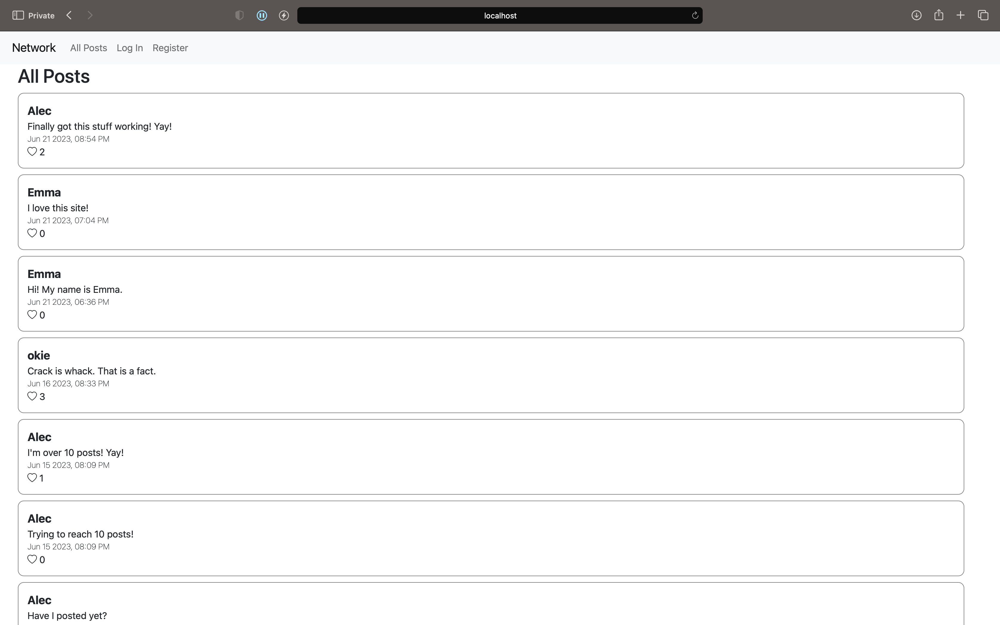
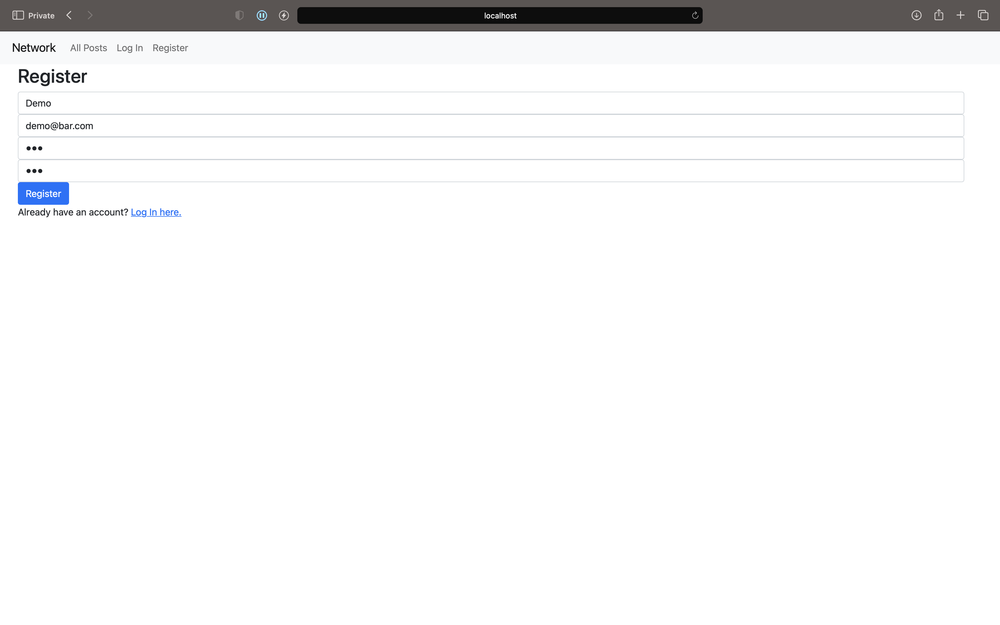
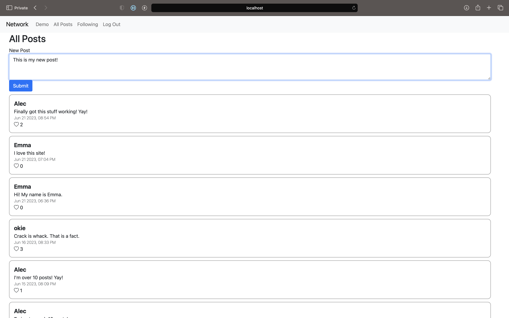
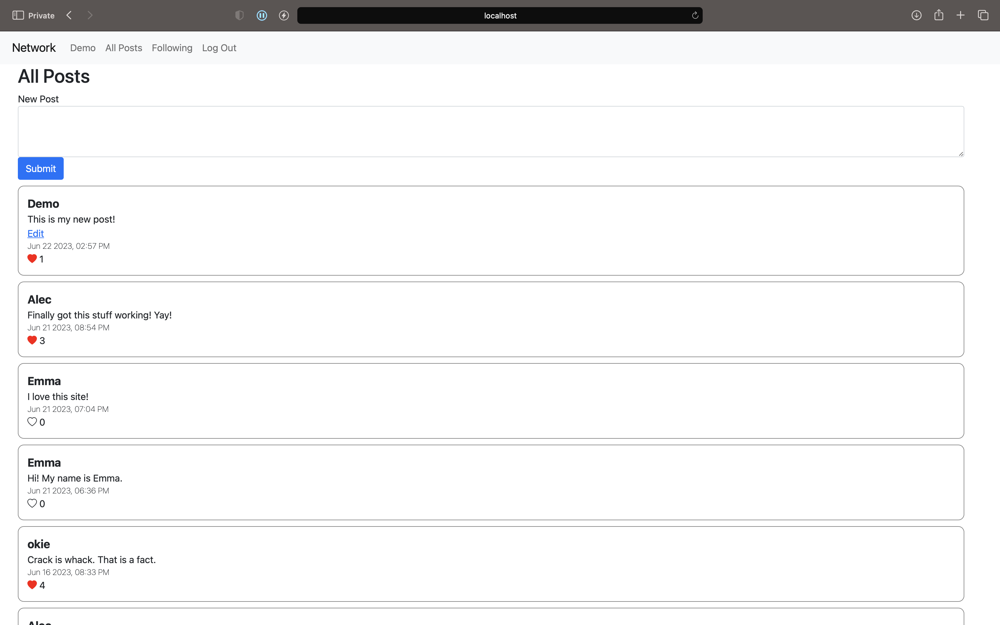
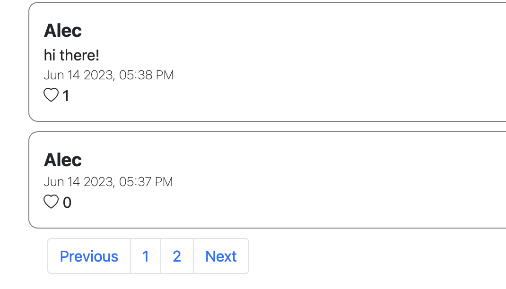
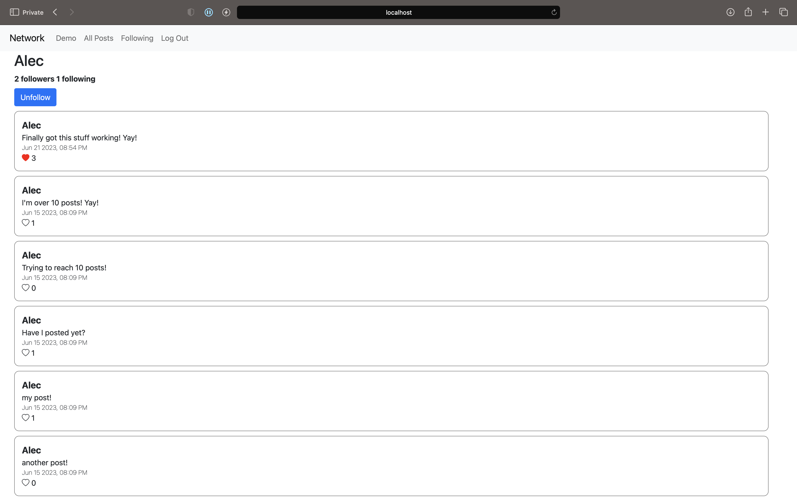
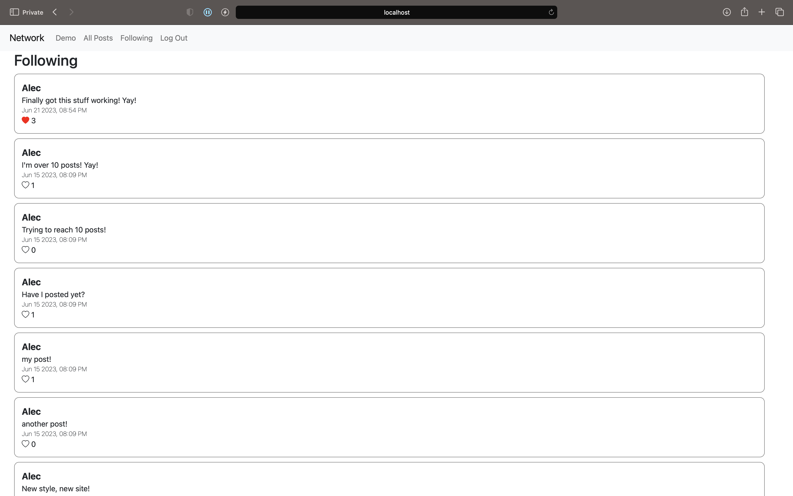
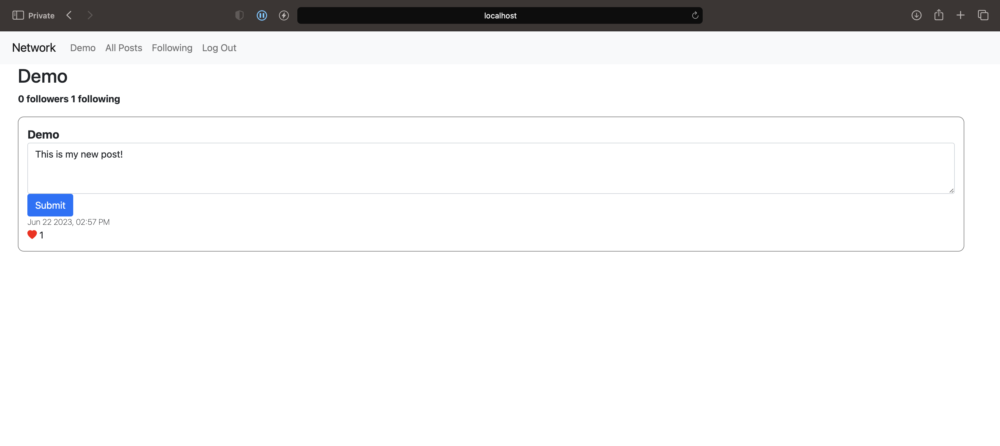

# Network
A social networking web app built with custom front and back ends. The front end was created with HTML, CSS, and JavaScript. The back end uses Django and 
SQLite. 

Much like Twitter, users can log in, share posts, like posts, and follow other users. The front end uses JavaScript and the Fetch API to let users interact with
the application without needless refreshing. This front end makes calls to a custom Django API that returns JSON responses. 

# Walkthrough
When a user first visits the site, they're brought to an "All Posts" feed. They cannot like or create posts until they log in.

  

If a user hasn't created an account before, they can register with a username, email, and password.

  

Once the user has logged in, they can create a new post!

  

Users can also like posts. The like count/status will update without page refresh via an asynchronous JavaScript call to the back end API.

  

Users' feed is paginated, with a maximum of ten posts per page. This pagination is supported on both the front and back ends.

  

Clicking on a username will navigate to their profile page. A user will then have the option to start following that profile.

  

Every user has a "Following" page where they can view all posts made by the profiles they follow, organized by date.

  

Users also have the opportunity to edit their own posts.

  

This project was completed with knowledge gained from Harvard's CS50W course.
